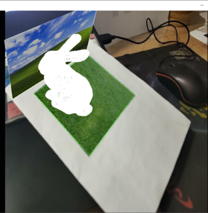
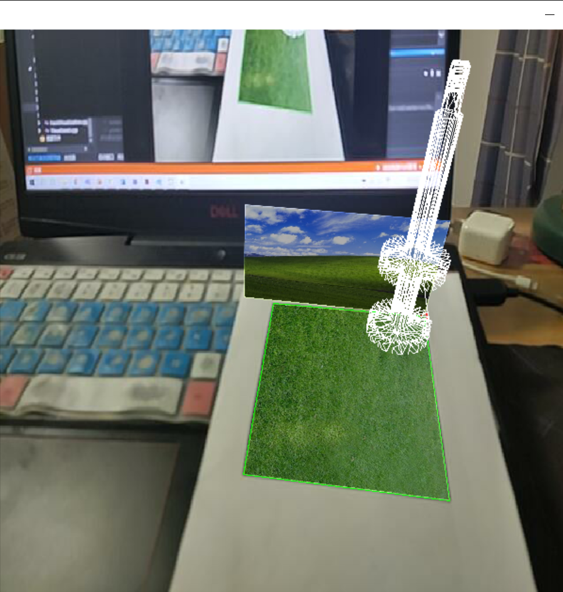

# Pose-estimation-and-AR

## 实际效果

|  ply模型   | stl模型  |
|  :----:  | :----: |
|  |  |

## 目录结构
- src
    - main.cpp                  主程序入口
    - CalibrationChessboard.cpp 标定程序
    - detectMarkers.cpp         Aruco码检测
    - PoseDetectAruco.cpp       AR主程序
    - PoseEstimation.cpp        相机姿态解算
    - ReadModel.cpp             读取模型文件
    - trackVisualiztion.cpp     相机姿态可视化
    - Visualizexd.cpp           2图片、3维模型可视化

- header                        对应的头文件目录
- Img                           标定和实验用图目录
- models                        .stl和.ply模型目录

## 实验内容

`main`函数中可选进行标定或主实验内容`detectPoseShow`。

若选择`detectPoseShow`，可利用`ReadModelFile`类读取模型文件。

程序在检测到指定的Aruco码(见Img目录)后将自动依据模型类别选择合适的方式可视化。

连续检测`TRACK_NUM (100)`次后将显示相机姿态轨迹。

## Note
- 若模型尺寸不对，可以调节对应函数的`ratio`参数。

## 使用的Opencv库函数
```cpp
remap(); 
bitwise_and(); 
hconcat(); 
vconcat(); 
SVDecomp();
polylines(); 
circle(); 
cvtColor(); 
findChessboardCorners(); 
drawChessboardCorners();
```